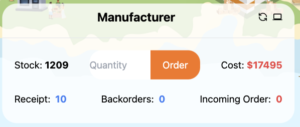
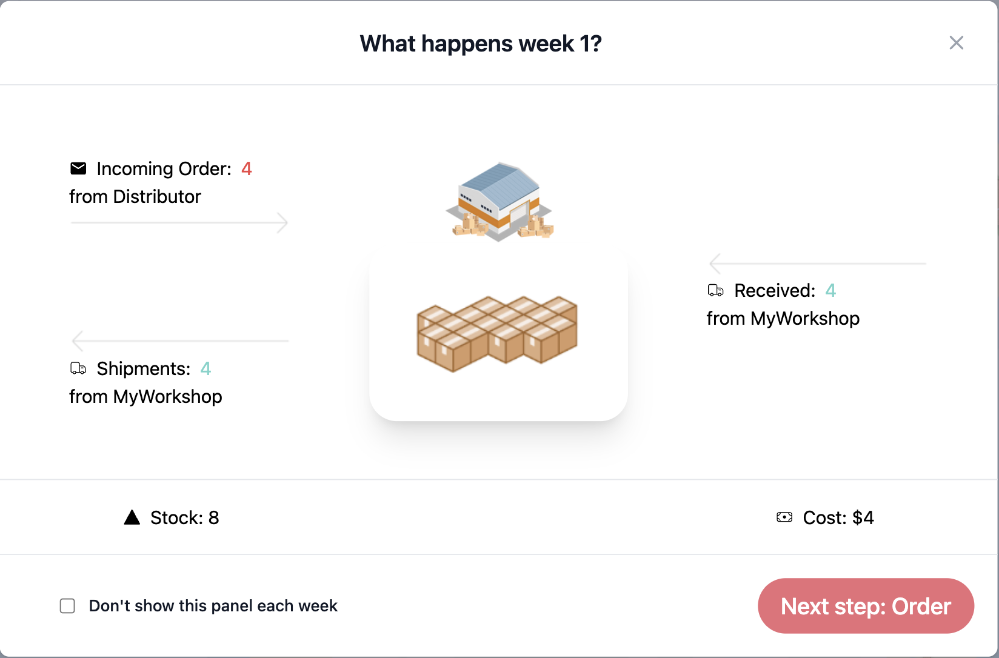

# Game Mechanics Breakdown

### Order Placement
At the start of each round, each player places an order with the previous link in the supply chain (e.g., the retailer places an order with the wholesaler). The factory produces beer while all other players manage the flow of goods through the chain. Players must decide how much beer to order based on their current stock levels, backlog, anticipated demand, and delivery lead times.

### Demand and Inventory Management
Retailers face customer demand, which fluctuates in each round. Retailers place orders based on expected future customer orders, trying to balance having enough inventory without overstocking.

Wholesalers, distributors, and the factory rely on their downstream partners (e.g., the retailer or wholesaler) to forecast demand, adjusting their orders accordingly. Since none of them knows actual customer demand, they must predict it based on orders placed with them.

Inventory is displayed for each player showing:
- **Current Stock Levels**: The number of beer units available in stock.
- **Orders in Transit**: Orders that have been placed but not yet received.
- **Backlogs**: Orders that could not be fulfilled due to a shortage of stock. Backlogs accumulate costs.

### Beer Deliveries
Orders placed in a previous round are delivered after a specific lead time (e.g., 2-3 rounds). This time lag simulates real-world delays in production and shipping. The factory is responsible for producing the beer and delivering it to the distributor, while the distributor, wholesaler, and retailer manage the flow of products through the chain.

### Cost Management
Players incur costs for both overstocking and backorders (not having enough stock to meet demand):
- **Holding Costs**: Costs incurred for holding excess inventory. Having too much beer in stock increases storage costs.
- **Backlog Costs**: Costs incurred when customer demand cannot be met due to insufficient inventory.

The challenge is to keep these costs as low as possible, which requires careful coordination and anticipation of demand throughout the chain.

### End of Round
At the end of each round, the game provides an updated status of inventory levels, orders placed, and costs incurred. Players can track their progress and adjust their strategy in future rounds to improve their performance.

