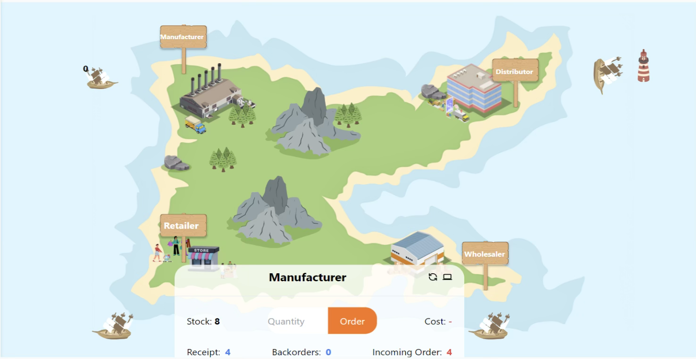

# Roles in the Game
There are four main roles representing different stages in the beer supply chain:

- **Manufacturer**: Responsible for producing beer and delivering it to the distributor. The manufacturer has to balance production rates with distributor demand.
- **Distributor**: Orders beer from the manufacturer and delivers it to the wholesaler. Their task is to forecast wholesaler demand while managing factory lead times.
- **Wholesaler**: Orders beer from the distributor and supplies it to the retailer. Wholesalers are directly impacted by retail demand.
- **Retailer**: The final stage of the supply chain. The retailer sells beer directly to customers and orders beer from the wholesaler based on consumer demand.

Each of these roles is interdependent, and miscommunication or poor forecasting in one role can lead to supply chain inefficiencies, leading to overstocking or shortages.

